# 🧠 Learning Summary — Semantic Search POC

## What the POC Does (big picture)

```mermaid
flowchart LR
    A["📄 Movie titles\n+ genres"] -->|encode| B["🔢 384-dim\nvectors"]
    B -->|store| C["📦 FAISS\nindex"]
    D["🔍 'sad robot\nmovie'"] -->|encode| E["🔢 query\nvector"]
    E -->|search| C
    C -->|nearest 5| F["🎬 Results"]
```



A user's text query gets converted into the **same vector space** as the movies, then we find the closest movie vectors. That's the whole idea.

---

## 1. Sentence-Transformers — Text → Vector

**What it does:** Takes any text string and converts it into a **384-dimensional float vector** — a list of 384 numbers that capture the *meaning* of the text.

```python
model = SentenceTransformer("all-MiniLM-L6-v2")
embedding = model.encode(["sad robot movie"])
# → numpy array of shape (1, 384)
```

**Why 384?** That's the architecture of the `all-MiniLM-L6-v2` model — a distilled BERT variant optimized for speed. Bigger models (768 or 1024 dims) capture more nuance but are slower.

**Key insight:** Texts with *similar meaning* land **close together** in this 384-dimensional space, even if they share zero words:
- `"sad robot movie"` → close to `"melancholy android film"`
- `"sad robot movie"` → far from `"delicious pasta recipe"`

> [!NOTE]
> This model was trained on over 1 billion sentence pairs so it learned what "similar meaning" looks like across many domains.

---

## 2. FAISS — Fast Vector Similarity Search

**Problem:** If you have 1 million movie vectors, comparing your query to *every single one* means 1 million distance calculations. That's O(n) per query.

**What FAISS does:** Facebook AI Similarity Search — a C++ library (with Python bindings) designed to search through millions/billions of vectors efficiently.

### IndexFlatL2 — What each word means

| Part | Meaning |
|------|---------|
| **Index** | A data structure holding all the vectors |
| **Flat** | **Brute-force** — compares against every vector (no shortcuts) |
| **L2** | Uses **Euclidean distance** (L2 norm) to measure similarity |

```python
index = faiss.IndexFlatL2(384)   # 384 = vector dimension
index.add(embeddings)            # add all movie vectors
distances, indices = index.search(query_vec, k=5)  # find 5 nearest
```

> [!IMPORTANT]
> `IndexFlatL2` is the **simplest** FAISS index — it's exact brute-force search. It gives perfect results but doesn't scale. For production with millions of vectors, you'd use approximate indices like `IndexIVFFlat` or `IndexHNSW` that trade a tiny bit of accuracy for 100× speed.

### L2 Distance → Similarity

L2 distance = `√(Σ(a_i - b_i)²)` — lower means more similar. We convert to a 0–1 similarity score:

```python
similarity = 1 / (1 + distance)
# distance=0 → similarity=1.0 (identical)
# distance=∞ → similarity→0.0 (nothing alike)
```

---

## 3. Why Only 100 Movies for the POC?

| Movies | Encoding time | Index build | Search time |
|--------|--------------|-------------|-------------|
| **100** | **~3s** | **0.0001s** | **0.02s** |
| 9,742 (all) | ~30s | ~0.01s | ~0.1s |
| 1,000,000 | ~hours | ~minutes | ~seconds |

The POC goal was to **validate the concept works end-to-end**, not optimize. 100 movies is enough to prove: data loads → embeddings work → search returns relevant results.

> [!TIP]
> In the real app, we'll encode all 9,742 movies and cache the embeddings to disk so we only pay the encoding cost once.

---

## 4. What the Results Tell Us

```
🎬  Top 5 results for "sad robot movie":
  1. Cry, the Beloved Country (1995)  — Drama        (sim: 0.4573)
  2. Dead Man Walking (1995)          — Crime|Drama   (sim: 0.4429)
  3. Lamerica (1994)                  — Adventure     (sim: 0.4420)
  4. Now and Then (1995)              — Children      (sim: 0.4372)
  5. Kicking and Screaming (1995)     — Comedy|Drama  (sim: 0.4350)
```

**Why no robot movies?** Because we only indexed 100 movies and our "summaries" are just `title + genres` — they don't mention robots. With real plot descriptions and the full dataset, results would be dramatically better.

> [!TIP]
> This is exactly why the next step is to bring in **real movie descriptions** (from TMDb or similar) instead of faking them with `title + genres`.

---

## Key Takeaways

1. **Sentence-transformers** converts text → 384-dim vectors that capture *meaning*
2. **FAISS** makes searching through those vectors fast (and scales to billions)
3. **IndexFlatL2** = brute-force exact search using Euclidean distance — simple but correct
4. **100 movies** = fast iteration, proves the pipeline works before scaling up
5. **Garbage in, garbage out** — fake summaries limit result quality; real descriptions will transform results
